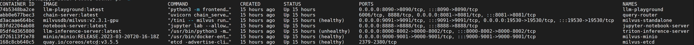

# Open chat core

## Project Details
**Project Goal**: An external reference for a chatbot to question answer off public press releases & tech blogs. Performs document ingestion & Q&A interface using best open models in any cloud or customer datacenter with TRT-LLM for speed with custom LangChain LLM wrapper. 

### Architecture


### Components
- **LLM**: Llama2 -- 7b, 13b, and 70b all supported. 13b and 70b generate good responses. Wanted best open-source model available at the time of creation. 
- **LLM Backend**: TRT-LLM for speed.
- **Vector DB**: Milvus because it's GPU accelerated.
- **Embedding Model**: e5-large-v2 since it appeared to be one of the best embedding model available at the moment. 
- **Framework(s)**: LangChain and LlamaIndex.

## Prerequisites
Before continuing with this guide, ensure the following prerequisites are met:

- At least one NVIDIA GPU. For this guide, we used A100 data center GPU.

    - NVIDIA driver version 535 or newer. To check the driver version run: ``nvidia-smi --query-gpu=driver_version --format=csv,noheader``.
    - If you are running multiple GPUs they must all be set to the same mode (ie Compute vs. Display). You can check compute mode for each GPU using
    ``nvidia-smi -q -d compute``

### Setup the following

- Docker and Docker-Compose

    - Please refer to [installation instructions](https://docs.docker.com/engine/install/ubuntu/).

        Note:
            Please do **not** use Docker that is packaged with Ubuntu as the newer version of Docker is required for proper Docker Compose support.

            Make sure your user account is able to execute Docker commands.


- NVIDIA Container Toolkit

    - Please refer to [installation instructions](https://docs.nvidia.com/datacenter/cloud-native/container-toolkit/install-guide.html).

        Here is the break down of the instruction for ubuntu
        - [Install Nvidia container toolkit using apt](https://docs.nvidia.com/datacenter/cloud-native/container-toolkit/latest/install-guide.html#installing-with-apt)

        - [Configure docker for Nvidia toolkit](https://docs.nvidia.com/datacenter/cloud-native/container-toolkit/latest/install-guide.html#configuring-docker)

        - [Verify You Have a CUDA-Capable GPU](https://docs.nvidia.com/cuda/cuda-installation-guide-linux/index.html#pre-installation-actions) follow instruction from 2.1 to 2.4

        - [Install Nvidia driver](https://docs.nvidia.com/datacenter/tesla/tesla-installation-notes/index.html#ubuntu-lts)

        - [Enable power setup](https://docs.nvidia.com/cuda/cuda-installation-guide-linux/index.html#environment-setup)

        - [Run a sample workload with Docker](https://docs.nvidia.com/datacenter/cloud-native/container-toolkit/latest/sample-workload.html#running-a-sample-workload-with-docker) to test nvidia container


- NGC Account and API Key

    - Please refer to [instructions](https://docs.nvidia.com/ngc/gpu-cloud/ngc-overview/index.html).

- You can download Llama2 Chat Model Weights from [Meta](https://ai.meta.com/resources/models-and-libraries/llama-downloads/) or [HuggingFace](https://huggingface.co/meta-llama/Llama-2-13b-chat-hf/).

    **Note for checkpoint downloaded using Meta**:

        When downloading model weights from Meta, you can follow the instructions up to the point of downloading the models using ``download.sh``. You don't need to deploy the model using the steps mentioned in the repository. We will use Triton to deploy the model.
        Meta will download ``tokenizer.model`` and ``tokenizer_checklist.chk``" outside of the model checkpoint directory. Be sure to copy these files into the same directory as the model checkpoint directory.

    **Note**:

        In this workflow, we will be leveraging a Llama2 (13B parameters) chat model, which requires 50 GB of GPU memory.  If you prefer to leverage 7B parameter model, this will require 38GB memory. The 70B parameter model initially requires 240GB memory.
        IMPORTANT:  For this initial version of the workflow, an A100 GPU is supported.


## Install Guide

###  Step 1: Set Environment Variables
1. Move to deploy directory
    ```
    cd deploy
    ```
2. Modify ``compose.env`` in the ``deploy`` directory to set your environment variables. The following variables are required.

    ```
    # full path to the local copy of the model weights
    export MODEL_DIRECTORY="$HOME/src/Llama-2-13b-chat-hf"

    # the architecture of the model. eg: llama
    export MODEL_ARCHITECTURE="llama"

    # the name of the model being used - only for displaying on frontend
    export MODEL_NAME="llama-2-13b-chat"

    # [OPTIONAL] the config file for chain server
    APP_CONFIG_FILE=/dev/null
    ```


### Step 3: Build and Start Containers
1. Run the following command to build containers.
    ```
        source compose.env; docker compose build
    ```

2. Run the following command to start containers.
    ```
        source compose.env; docker compose up -d
    ```
    > ⚠️ **NOTE**: It will take a few minutes for the containers to come up and may take up to 5 minutes for the Triton server to be ready. Adding the `-d` flag will have the services run in the background. ⚠️ 

3. Run ``docker ps -a``. When the containers are ready the output should look similar to the image below.
    

### Step 4: Experiment with RAG in JupyterLab

This AI Workflow includes Jupyter notebooks which allow you to experiment with RAG.

1. Using a web browser, type in the following URL to open Jupyter

    ``http://host-ip:8888``

2. Locate the LLM Streaming Client notebook ``01-llm-streaming-client.ipynb`` which demonstrates how to stream responses from the LLM.
3. Proceed with the next 4 notebooks:

    - Document Question-Answering with LangChain ``02_langchain_simple.ipynb``

    - Document Question-Answering with LlamaIndex ``03_llama_index_simple.ipynb``

    - Advanced Document Question-Answering with LlamaIndex ``04_llamaindex_hier_node_parser.ipynb``

    - Interact with REST FastAPI Server ``05_dataloader.ipynb``

### Step 5: Run the Sample Web Application
A sample chatbot web application is provided in the workflow. Requests to the chat system are wrapped in FastAPI calls.

1. Open the web application at ``http://host-ip:8090``.

2. Type in the following question without using a knowledge base: "How many cores are on the Nvidia Grace superchip?"

    **Note:** the chatbot mentions the chip doesn't exist.

3. To use a knowledge base:

    - Click the **Knowledge Base** tab and upload the file [nvlink.pd]().

4. Return to **Converse** tab and check **[X] Use knowledge base**.

5. Retype the question:  "How many cores are on the Nvidia Grace superchip?"

