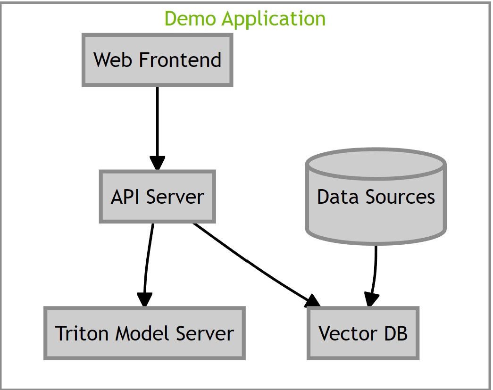

# Retrieval Augmented Generation

## Project Details
**Project Goal**: A optimized reference Retrieval Augmented Generation(RAG) workflow for a chatbot utilizing cutting-edge NVIDIA AI Enterprise Microservices. This workflow is using [Nemo Microservice Inference (EA)](nvcr.io/ohlfw0olaadg/ea-participants/nemollm-inference-ms:23.10) for LLM model deployment. In this example we will ingest a collection of NVIDIA press releases and blogs.

## Components
- **LLM**: [Llama2](https://ai.meta.com/llama/) - 7b, 13b, and 70b all supported. 13b and 70b generate good responses. `NeMo LLM`- NV-GPT-8B-base, NV-GPT-43B-chat
- **LLM Backend**: [NeMo Microservice Inference (NMI)](https://registry.ngc.nvidia.com/orgs/ohlfw0olaadg/teams/ea-participants/containers/nemollm-inference-ms) incorporates CUDA, TRT, TRT-LLM, and Triton, NMI brings state of the art GPU accelerated Large Language model serving.
- **Vector DB**: Milvus because it's GPU accelerated.
- **Embedding Model**: [e5-large-v2](https://huggingface.co/intfloat/e5-large-v2) since it is one of the best embedding model available at the moment.
- **Framework(s)**: LangChain and LlamaIndex.

This reference workflow uses a variety of components and services to customize and deploy the RAG based chatbot. The following diagram illustrates how they work together. Refer to the [detailed architecture guide](../docs/rag/architecture.md) to understand more about these components and how they are tied together.




*Note:*
We've used [Llama2](https://ai.meta.com/llama/) and [e5-large-v2](https://huggingface.co/intfloat/e5-large-v2) models as example defaults in this workflow, you should ensure that both the LLM and embedding model are appropriate for your use case, and validate that they are secure and have not been tampered with prior to use.

# Getting Started
This section covers step by step guide to setup and try out this example workflow.

## Prerequisites
Before proceeding with this guide, make sure you meet the following prerequisites:

- You should have at least one NVIDIA GPU. For this guide, we used an A100 data center GPU.

    - NVIDIA driver version 535 or newer. To check the driver version run: ``nvidia-smi --query-gpu=driver_version --format=csv,noheader``.
    - If you are running multiple GPUs they must all be set to the same mode (ie Compute vs. Display). You can check compute mode for each GPU using
    ``nvidia-smi -q -d compute``

- You should have access to [NeMo Microservice Inference](https://registry.ngc.nvidia.com/orgs/ohlfw0olaadg/teams/ea-participants/containers/nemollm-inference-ms) to download the container used for deploying the Large Language Model.

### Setup the following

- Docker and Docker-Compose are essential. Please follow the [installation instructions](https://docs.docker.com/engine/install/ubuntu/).

        Note:
            Please do not use Docker that is packaged with Ubuntu as the newer version of Docker is required for proper Docker Compose support.

            Make sure your user account is able to execute Docker commands.


- NVIDIA Container Toolkit is also required. Refer to the [installation instructions](https://docs.nvidia.com/datacenter/cloud-native/container-toolkit/install-guide.html).


- NGC Account and API Key

    - Please refer to [instructions](https://docs.nvidia.com/ngc/gpu-cloud/ngc-overview/index.html) to create account and generate NGC API key.
    - Docker login to `nvcr.io` using the following command:
      ```
        docker login nvcr.io
      ```

- You can download the model from NGC.

    1. Download the llama2 13b model from ngc
    ```
    ngc registry model download-version "ohlfw0olaadg/ea-participants/llama-2-13b-chat:LLAMA-2-13B-CHAT-4K-FP16"
    ```
    Note: You can check list of available models using
    ```
    ngc registry model list "ohlfw0olaadg/ea-participants/*"
    ```

    2. Move to the downloaded directory and unzip the model
    ```
    cd llama-2-13b-chat_vLLAMA-2-13B-CHAT-4K-FP16/
    tar -xzf LLAMA-2-13B-CHAT-4K-FP16.tar.gz
    ```
    3. Check `model-store` directory after unzipping in the same directory.

    Note: List of supported model and their version are mentioned below. You might see inference failure when using other model version
    | Model Name  | Model Version Supported |
    | ------------- |:-------------:|
    | [Llama-2-70b](https://registry.ngc.nvidia.com/orgs/ohlfw0olaadg/teams/ea-participants/models/llama-2-70b)      | Llama-2-70b:LLAMA-2-70B-4K-FP16     |
    | [Llama-2-70b-Chat](https://registry.ngc.nvidia.com/orgs/ohlfw0olaadg/teams/ea-participants/models/llama-2-70b-chat)      | Llama-2-70b-Chat:LLAMA-2-70B-CHAT-4K-FP16     |
    | [Llama-2-13b](https://registry.ngc.nvidia.com/orgs/ohlfw0olaadg/teams/ea-participants/models/llama-2-13b)      | Llama-2-13b:LLAMA-2-13B-4K-FP16 |
    | [Llama-2-13b-Chat](https://registry.ngc.nvidia.com/orgs/ohlfw0olaadg/teams/ea-participants/models/llama-2-13b-chat)      | Llama-2-13b-Chat:LLAMA-2-13B-CHAT-4K-FP16     |
    | [Llama-2-7b](https://registry.ngc.nvidia.com/orgs/ohlfw0olaadg/teams/ea-participants/models/llama-2-7b)      | Llama-2-7b:LLAMA-2-7B-4K-FP16 |
    | [Llama-2-7b-Chat](https://registry.ngc.nvidia.com/orgs/ohlfw0olaadg/teams/ea-participants/models/llama-2-7b-chat)      | Llama-2-7b-Chat:LLAMA-2-7B-CHAT-4K-FP16 |
    | [NV-GPT-8B-base](https://registry.ngc.nvidia.com/orgs/ohlfw0olaadg/teams/ea-participants/models/nv-gpt-8b-base)      | NV-GPT-8B-base:NV-GPT-8B-base-4K-FP16-1 |


## Install Guide

Follow the below steps from the root of this project to setup the RAG example.

###  Step 1: Set Environment Variables

Modify ``compose.env`` in the ``deploy/compose`` directory to set your environment variables. The following variables are required.

    # full path to the model store directory of downloaded model
    export MODEL_DIRECTORY="$HOME/src/Llama-2-13b-chat-hf"

    # the architecture of the model. eg: llama
    export MODEL_ARCHITECTURE="llama"

    # the name of the model being used - only for displaying on frontend
    export MODEL_NAME="llama-2-13b-chat"

    # [OPTIONAL] the config file for chain server
    APP_CONFIG_FILE=/dev/null

Note: If you're using `NV-GPT-8B-base`, use [nemotron_config.yaml](../deploy/compose/nemotron_config.yaml) as `APP_CONFIG_FILE` in [compose.env](../deploy/compose/compose.env) for proper response.

### Step 2: Start Containers
- Run the following command to start containers.
    ```
        source deploy/compose/compose.env; docker compose -f deploy/compose/docker-compose-enterprise.yaml up -d
    ```

- Run ``docker ps -a``. When the containers are ready the output should look similar to the image below.
    


### Step 3: Run the Sample Web Application
A sample chatbot web application is provided in the workflow. Requests to the chat system are wrapped in FastAPI calls.

- Open the web application at ``http://host-ip:8090``.

- Type in the following question without using a knowledge base: "How many cores are on the Nvidia Grace superchip?"

    **Note:** the chatbot mentions the chip doesn't exist.

- To use a knowledge base:

    - Click the **Knowledge Base** tab and upload the file [dataset.zip](../notebooks/dataset.zip).

- Return to **Converse** tab and check **[X] Use knowledge base**.

- Retype the question:  "How many cores are on the Nvidia Grace superchip?"

### Step 4: Experiment with RAG in JupyterLab

This AI Workflow includes Jupyter notebooks which shows inference with nemo microservice inference server.

- Using a web browser, type in the following URL to open Jupyter

    ``http://host-ip:8888``

- Locate the [Nemo Inferense MS LLM Streaming Client notebook](../notebooks/01-nemo-inference-ms-llm-streaming-client.ipynb)


## Chain Server
The Chain server acts as the central component, coordinating interactions with the embedding model and Milvus vector store. It generates embeddings using the embedding model, ingests those embeddings into the Milvus vector store, retrieves relevant documents from Milvus, and forwards those documents along with user queries to the LLM for response generation orchestrated by llama index and langchain.

Chain server's core logic resides in [developer_rag](./examples/developer_rag/) dir, llm integration is in [llm](../integrations/langchain/llms/) and utility code is present in [common](./common/). You can modify this to change the behavior of pipeline as per your use case.

### Building chain server container
1. Remove existing chain server image
    ```
    docker rmi nvcr.io/ohlfw0olaadg/ea-rag-examples/enterprise-rag:0.2.0-chain-server
    ```
2. Remove any stale layer for the image
    ```
    docker system prune -a
    ```
3. Build chain server image from scratch
    ```
    source deploy/compose/compose.env;  docker compose -f deploy/compose/docker-compose-enterprise.yaml build query
    ```
4. You can deploy the e2e pipeline
    ```
    source deploy/compose/compose.env; docker compose -f deploy/compose/docker-compose-enterprise.yaml up -d
    ```

# Learn More
1. [Architecture Guide](../docs/rag/architecture.md): Detailed explanation of different components and how they are tried up together.
2. Component Guides: Component specific features are enlisted in these sections.
   1. [Chain Server](../docs/rag/chat_server.md)
   2. [NeMo Microservice Inference Server](https://registry.ngc.nvidia.com/orgs/ohlfw0olaadg/teams/ea-participants/containers/nemollm-inference-ms)
   3. [Sample frontend](../docs/rag/frontend.md)
3. [Configuration Guide](../docs/rag/configuration.md): This guide covers different configurations available for this workflow.
4. [Support Matrix](../docs/rag/ssupport_matrix.md): This covers GPU, CPU, Memory and Storage requirements for deploying this workflow.