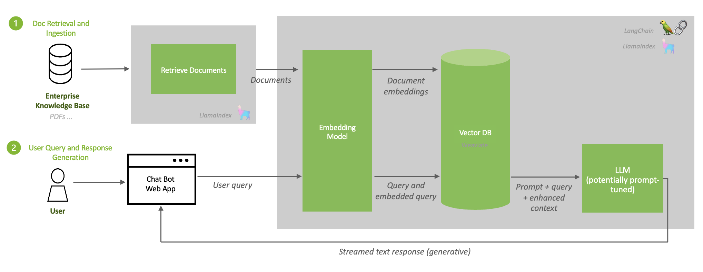

# Open chat core

## Project Details
**Project Goal**: An external reference for a chatbot to question answer off public press releases & tech blogs. Performs document ingestion & Q&A interface using best open models in any cloud or customer datacenter with TRT-LLM for speed with custom LangChain LLM wrapper. 

### Architecture

### Components
- **LLM**: Llama2 -- 7b, 13b, and 70b all supported. 13b and 70b generate good responses. Wanted best open-source model available at the time of creation. 
- **LLM Backend**: TRT-LLM for speed.
- **Vector DB**: Milvus because it's GPU accelerated.
- **Embedding Model**: e5-large-v2 since it appeared to be one of the best embedding model available at the moment. 
- **Framework(s)**: LangChain and LlamaIndex.
