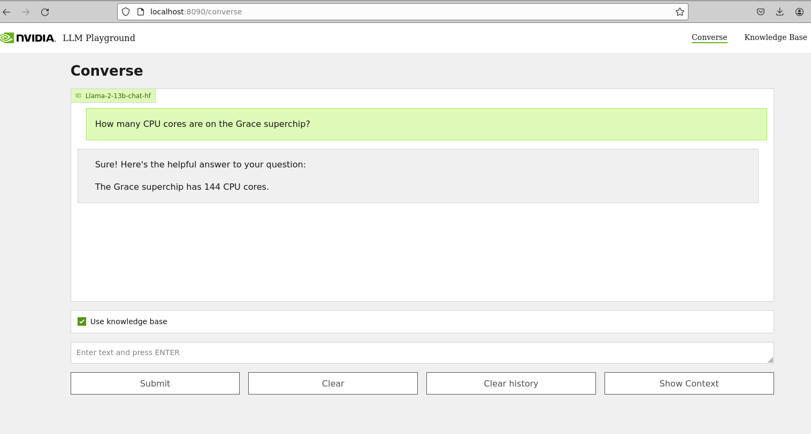

# Retrieval Augmented Generation - Enterprise Version

Retrieval Augmented Generation (RAG) generates up-to-date and domain-specific answers by connecting a Large Language Model (LLM) to your enterprise data using state of the art NeMo microservices.


## RAG Examples

1. [QA Chatbot -- A100/H100/L40S](#1-qa-chatbot----a100h100l40s-gpu)

<hr>


### 1: QA Chatbot -- A100/H100/L40S GPU

This example deploys a enterprise RAG pipeline for chat QA and serves inferencing via the using [Nemo Microservice Inference (EA)](https://registry.ngc.nvidia.com/orgs/ohlfw0olaadg/teams/ea-participants/containers/nemollm-inference-ms) .
> ⚠️ **NOTE**: This example requires an A100, H100, or L40S GPU.

<table class="tg">
<thead>
  <tr>
    <th class="tg-6ydv">Model</th>
    <th class="tg-6ydv">Embedding</th>
    <th class="tg-6ydv">Framework</th>
    <th class="tg-6ydv">Description</th>
    <th class="tg-6ydv">Multi-GPU</th>
    <th class="tg-6ydv">TRT-LLM</th>
    <th class="tg-6ydv">NVIDIA AI Foundation</th>
    <th class="tg-6ydv">Triton</th>
    <th class="tg-6ydv">Vector Database</th>
  </tr>
</thead>
<tbody>
  <tr>
    <td class="tg-knyo">llama-2</td>
    <td class="tg-knyo">NV-Embed-QA-003</td>
    <td class="tg-knyo">Llamaindex</td>
    <td class="tg-knyo">QA chatbot</td>
    <td class="tg-knyo">NO</td>
    <td class="tg-knyo">YES</td>
    <td class="tg-knyo">NO</td>
    <td class="tg-knyo">YES</td>
    <td class="tg-knyo">Milvus/PGVector</td>
  </tr>
</tbody>
</table>


*Note:*
We've used [Llama2](https://ai.meta.com/llama/) and NV-Embed-QA-003 models as example defaults in this workflow, you should ensure that both the LLM and embedding model are appropriate for your use case, and validate that they are secure and have not been tampered with prior to use.

#### 1.1 Prepare the environment
1. Install [Docker Engine and Docker Compose](https://docs.docker.com/engine/install/ubuntu/).

2. Verify NVIDIA GPU driver version 535 or later is installed.

```
535.129.03

$ nvidia-smi -q -d compute

==============NVSMI LOG==============

Timestamp                                 : Sun Nov 26 21:17:25 2023
Driver Version                            : 535.129.03
CUDA Version                              : 12.2

Attached GPUs                             : 1
GPU 00000000:CA:00.0
    Compute Mode                          : Default

```
Reference: [NVIDIA Container Toolkit](https://docs.nvidia.com/datacenter/cloud-native/container-toolkit/latest/install-guide.html) and [NVIDIA Linux driver installation instructions](https://docs.nvidia.com/datacenter/tesla/tesla-installation-notes/index.html)

3. Clone the Generative AI examples Git repository.
> ⚠️ NOTE: This example requires Git Large File Support (LFS)
```
sudo apt -y install git-lfs
git clone git@github.com:NVIDIA/GenerativeAIExamples.git
cd GenerativeAIExamples/
git lfs pull
```

4. Verify the NVIDIA container toolkit is installed and configured as the default container runtime.

```
$ cat /etc/docker/daemon.json
{
    "default-runtime": "nvidia",
    "runtimes": {
        "nvidia": {
            "path": "/usr/bin/nvidia-container-runtime",
            "runtimeArgs": []
        }
    }
}

$ sudo docker run --rm --runtime=nvidia --gpus all ubuntu nvidia-smi -L
GPU 0: NVIDIA A100 80GB PCIe (UUID: GPU-d8ce95c1-12f7-3174-6395-e573163a2ace)
```

5. Create an NGC Account and API Key.

Please refer to [instructions](https://docs.nvidia.com/ngc/gpu-cloud/ngc-overview/index.html) to create account and generate NGC API key.

Docker login to `nvcr.io` using the following command:
```
docker login nvcr.io
```

Reference
- [Docker installation instructions (Ubuntu)](https://docs.docker.com/engine/install/ubuntu/)
- [NVIDIA Container Toolkit Installation instructions](https://docs.nvidia.com/datacenter/cloud-native/container-toolkit/latest/install-guide.html)

#### 1.2 Deploy

**Downloading the LLM model**
1. You can download the model from NGC or generate model repository.

    The models available in NGC are compiled for A100 machine, if you're using any other GPU you need to manually create the system specific TRT-LLM plan files. To understand this workflow please refer [model_conversion.md](./model_conversion.md). Refer to  [Nemo Inference Microservice(NIM)](https://developer.nvidia.com/docs/nemo-microservices/index.html) to know more about this.

    You can skip the conversion steps mentioned here, if you are using A100 GPU based system.

    **Note**: List of supported model and their version are mentioned below. Make sure you're using model version provided in the table and not the latest one. You will see **inference failure** when using other model version.
    | Model Name  | Model Version Supported |
    | ------------- |:-------------:|
    | [Llama-2-70b](https://registry.ngc.nvidia.com/orgs/ohlfw0olaadg/teams/ea-participants/models/llama-2-70b)      | ohlfw0olaadg/ea-participants/llama-2-70b:LLAMA-2-70B-4K-FP16-4-A100.24.01
     |
    | [Llama-2-70b-Chat](https://registry.ngc.nvidia.com/orgs/ohlfw0olaadg/teams/ea-participants/models/llama-2-70b-chat)      | ohlfw0olaadg/ea-participants/llama-2-70b-chat:LLAMA-2-70B-CHAT-4K-FP16-4-A100.24.01
     |
    | [Llama-2-13b](https://registry.ngc.nvidia.com/orgs/ohlfw0olaadg/teams/ea-participants/models/llama-2-13b)      | ohlfw0olaadg/ea-participants/llama-2-13b:LLAMA-2-13B-4K-FP16-1-A100.24.01 |
    | [Llama-2-13b-Chat](https://registry.ngc.nvidia.com/orgs/ohlfw0olaadg/teams/ea-participants/models/llama-2-13b-chat)      | ohlfw0olaadg/ea-participants/llama-2-13b-chat:LLAMA-2-13B-CHAT-4K-FP16-1-A100.24.01     |
    | [Llama-2-7b](https://registry.ngc.nvidia.com/orgs/ohlfw0olaadg/teams/ea-participants/models/llama-2-7b)      | ohlfw0olaadg/ea-participants/llama-2-7b:LLAMA-2-7B-4K-FP16-1-A100.24.01 |
    | [Llama-2-7b-Chat](https://registry.ngc.nvidia.com/orgs/ohlfw0olaadg/teams/ea-participants/models/llama-2-7b-chat)      | ohlfw0olaadg/ea-participants/llama-2-7b-chat:LLAMA-2-7B-CHAT-4K-FP16-1-A100.24.01 |
    | [NV-GPT-8B-base](https://registry.ngc.nvidia.com/orgs/ohlfw0olaadg/teams/ea-participants/models/nv-gpt-8b-base)      | ohlfw0olaadg/ea-participants/nv-gpt-8b-base:NV-GPT-8B-base-4K-FP16-1-A100.24.01 |


    1. Download the llama2 13b model from ngc
    ```
    ngc registry model download-version "ohlfw0olaadg/ea-participants/llama-2-13b-chat:LLAMA-2-13B-CHAT-4K-FP16-1-A100.24.01"
    ```
    Note: You can check list of available models using
    ```
    ngc registry model list "ohlfw0olaadg/ea-participants/*"
    ```

    2. Move to the downloaded directory and unzip the model
    ```
    cd llama-2-13b-chat_vLLAMA-2-13B-CHAT-4K-FP16-1-A100.24.01/
    tar -xzf LLAMA-2-13B-CHAT-4K-FP16-1-A100.24.01.tar.gz
    ```
    3. Check `model-store` directory after unzipping in the same directory.

**Downloading embedding the model**
1. You can download the embedding model from NGC.

    The embedding models available in NGC are compiled for A100 and L4 machine, model conversion for any other GPU is not supported as of now. Refer to  [Nemo Retriever Embedding Microservice](https://registry.ngc.nvidia.com/orgs/ohlfw0olaadg/teams/ea-participants/containers/nemo-retriever-embedding-microservice) to know more about this.

    **Note**: List of supported model and their version are mentioned below.
    | Model Name  | Model Version Supported |
    | ------------- |:-------------:|
    | [NV-Embed-QA-003](https://registry.ngc.nvidia.com/orgs/ohlfw0olaadg/teams/ea-participants/models/nv-embed-qa)      |   A100  | ohlfw0olaadg/ea-participants/nv-embed-qa:003-A100     |
    | [NV-Embed-QA-003](https://registry.ngc.nvidia.com/orgs/ohlfw0olaadg/teams/ea-participants/models/nv-embed-qa)      |    L4   | ohlfw0olaadg/ea-participants/nv-embed-qa:003-L4     |

    1. Download the embedding model from ngc
    ```
    ngc registry model download-version "ohlfw0olaadg/ea-participants/nv-embed-qa:003-A100"
    ```

**Deploying the model**
1. Set the absolute path to the model location in compose.env

Modify ``compose.env`` in the ``deploy/compose`` directory to set your environment variables. The following variables are required.

    # full path to the model store directory of downloaded model
    export MODEL_DIRECTORY="$HOME/src/Llama-2-13b-chat-hf"

    # the architecture of the model. eg: llama
    export MODEL_ARCHITECTURE="llama"

    # the name of the model being used - only for displaying on frontend
    export MODEL_NAME="llama-2-13b-chat"

    # full path to the model store directory storing the nemo embedding model
    export EMBEDDING_MODEL_DIRECTORY="/home/nvidia/nv-embed-qa_v003-A100"

2. [OPTIONAL] the config file for chain server can be updated in compose.env
    ```
    APP_CONFIG_FILE=/dev/null
    ```

    Note: If you're using `NV-GPT-8B-base`, use [nemotron_config.yaml](../../deploy/compose/nemotron_config.yaml) as `APP_CONFIG_FILE` in [compose.env](../../deploy/compose/compose.env) for proper response.

3. Deploy the enterprise RAG example via Docker compose using milvus vector store, steps to deploy RAG example with pgvector vector store is [here](#deploying-with-pgvector-vector-store).

```
$ source deploy/compose/compose.env; docker compose -f deploy/compose/docker-compose-enterprise.yaml up -d

$ docker ps --format "table {{.ID}}\t{{.Names}}\t{{.Status}}"
CONTAINER ID   NAMES                     STATUS
256da0ecdb7b   llm-playground               Up 48 minutes
2974aa4fb2ce   chain-server                 Up 48 minutes
0069c5e0b373   nemollm-inference-ms         Up 48 minutes
6044c2b8b421   nemo-retriever-embedding-ms  Up 48 minutes
5be2b57bb5c1   milvus-standalone            Up 48 minutes (healthy)
a6609c22c171   milvus-minio                 Up 48 minutes (healthy)
b23c0858c4d4   milvus-etcd                  Up 48 minutes (healthy)
```

#### 1.3 Test

1. Connect to the sample web application at ``http://host-ip:8090``.

2. In the <B>Converse</B> tab, type "How many cores are on the Nvidia Grace superchip?" iin the chat box and press <B>Submit</B>.


3.  Upload the sample data set to the <B>Knowledge Base</B> tab.

> ⚠️ **NOTE**: ``dataset.zip`` is located in the ``notebooks`` directory. Unzip the archive and upload the PDFs.

4. Return to **Converse** tab and check **[X] Use knowledge base**.

5. Retype the question:  "How many cores are on the Nvidia Grace superchip?"



> ⚠️ **NOTE**: Default prompts are optimized for llama chat model if you're using completion model then prompts need to be finetuned accordingly.

#### 1.4 Uninstall

To uninstall, stop and remove the running containers.

```
cd deploy/compose
source compose.env
docker compose -f docker-compose-enterprise.yaml down
docker compose ps -q
```

#### Deploying with [pgvector](https://github.com/pgvector/pgvector) vector store
2. Deploy the developer RAG example via Docker compose.

> ⚠️ **NOTE**: It may take up to 5 minutes for the Triton server to start. The `-d` flag starts the services in the background.

```
$ source deploy/compose/compose.env;  docker compose -f deploy/compose/docker-compose-pgvector.yaml build

$ docker compose -f deploy/compose/docker-compose-pgvector.yaml up -d

$ docker ps --format "table {{.ID}}\t{{.Names}}\t{{.Status}}"
CONTAINER ID   NAMES                  STATUS
0f6f091d892e   llm-playground               Up 22 hours
8d0ab09fcb98   chain-server                 Up 22 hours
0069c5e0b373   nemollm-inference-ms         Up 22 hours
6044c2b8b421   nemo-retriever-embedding-ms  Up 22 hours
cbd3cf65ce7e   pgvector                     Up 22 hours
```

After deployment is successful, you can follow steps from [Test](#13-test) to verify workflow.

<hr>


## Chain Server
The Chain server acts as the central component, coordinating interactions with the embedding model and Milvus vector store. It generates embeddings using the embedding model, ingests those embeddings into the Milvus vector store, retrieves relevant documents from Milvus, and forwards those documents along with user queries to the LLM for response generation orchestrated by llama index and langchain.

Chain server's core logic resides in [developer_rag](../../RetrievalAugmentedGeneration/examples/developer_rag/) dir, llm integration is in [llm](.../../integrations/langchain/llms/) and utility code is present in [common](../../RetrievalAugmentedGeneration//common/). You can modify this to change the behavior of pipeline as per your use case.

### Building chain server container
1. Remove existing chain server image
    ```
    docker rmi nvcr.io/ohlfw0olaadg/ea-rag-examples/enterprise-rag:0.2.0-chain-server
    ```
2. Remove any stale layer for the image
    ```
    docker system prune -a
    ```
3. Build chain server image from scratch
    ```
    source deploy/compose/compose.env;  docker compose -f deploy/compose/docker-compose-enterprise.yaml build query
    ```
4. You can deploy the e2e pipeline
    ```
    source deploy/compose/compose.env; docker compose -f deploy/compose/docker-compose-enterprise.yaml up -d
    ```

### Limitations
1. The [existing prompts in nemotron config file](../../deploy/compose/nemotron_config.yaml) do not work well for nemotron models. Some extra sentences may be added to response.
2. Default prompts work well with **llama chat** model, if you're using **completion** model, prompts need to be finetuned accordingly.


