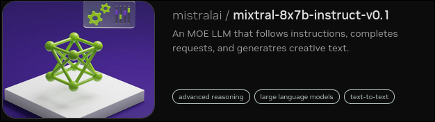
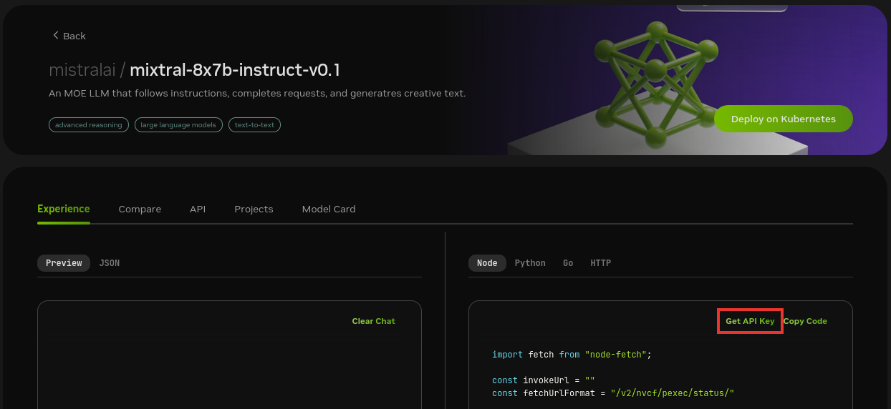

<!--
  SPDX-FileCopyrightText: Copyright (c) 2023 NVIDIA CORPORATION & AFFILIATES. All rights reserved.
  SPDX-License-Identifier: Apache-2.0

  Licensed under the Apache License, Version 2.0 (the "License");
  you may not use this file except in compliance with the License.
  You may obtain a copy of the License at

  http://www.apache.org/licenses/LICENSE-2.0

  Unless required by applicable law or agreed to in writing, software
  distributed under the License is distributed on an "AS IS" BASIS,
  WITHOUT WARRANTIES OR CONDITIONS OF ANY KIND, either express or implied.
  See the License for the specific language governing permissions and
  limitations under the License.
-->

# Multimodal Data

```{contents}
---
depth: 2
local: true
backlinks: none
---
```

## Example Features

This example deploys a developer RAG pipeline for chat Q&A and serves inferencing from an NVIDIA AI Foundation Models endpoint
instead of NVIDIA Triton Inference Server, a local Llama 2 model, or local GPUs.

Developers get free credits for 10K requests to any of the available models.

The key difference from [](./ai-foundation-models.md) example is that the example demonstrates how work with multimodal data.
The model works with any kind of image in PDF, such as graphs and plots, as well as text and tables.

This example uses models from the NVIDIA AI Foundation Models and Endpoints.

```{list-table}
:header-rows: 1
:widths: 30 10 10 10 10 10 10 10 10

* - Model
  - Embedding
  - Framework
  - Description
  - Multi-GPU
  - TRT-LLM
  - NVIDIA AI Foundation
  - Triton
  - Vector Database

* - Mixtral_8x7b for response generation,
    Deplot for graph to text conversion,
    Neva_22B for image to text conversion
  - nvolveqa_40k
  - Custom Python
  - QA chatbot
  - NO
  - NO
  - YES
  - NO
  - Milvus
```

The following figure shows the sample topology:

- The sample chat bot web application communicates with the chain server.
  The chain server sends inference requests to an NVIDIA AI Foundation Models endpoint.
- Optionally, you can deploy NVIDIA Riva. Riva can use automatic speech recognition to transcribe
  your questions and use text-to-speech to speak the answers aloud.


## Prerequisites

- Clone the Generative AI examples Git repository using Git LFS:

  ```console
  $ sudo apt -y install git-lfs
  $ git clone git@github.com:NVIDIA/GenerativeAIExamples.git
  $ cd GenerativeAIExamples/
  $ git lfs pull
  ```

- Install Docker Engine and Docker Compose.
  Refer to the instructions for [Ubuntu](https://docs.docker.com/engine/install/ubuntu/).

- Optional: Enable NVIDIA Riva automatic speech recognition (ASR) and text to speech (TTS).

  - To launch a Riva server locally, refer to the [Riva Quick Start Guide](https://docs.nvidia.com/deeplearning/riva/user-guide/docs/quick-start-guide.html).

    - In the provided `config.sh` script, set `service_enabled_asr=true` and `service_enabled_tts=true`, and select the desired ASR and TTS languages by adding the appropriate language codes to `asr_language_code` and `tts_language_code`.

    - After the server is running, assign its IP address (or hostname) and port (50051 by default) to `RIVA_API_URI` in `deploy/compose/compose.env`.

  - Alternatively, you can use a hosted Riva API endpoint. You might need to obtain an API key and/or Function ID for access.

    In `deploy/compose/compose.env`, make the following assignments as necessary:

    ```bash
    export RIVA_API_URI="<riva-api-address/hostname>:<port>"
    export RIVA_API_KEY="<riva-api-key>"
    export RIVA_FUNCTION_ID="<riva-function-id>"
    ```

## Get an API Key for the Mixtral 8x7B Instruct API Endpoint

Perform the following steps if you do not already have an API key.
You can use different model API endpoints with the same API key.

1. Navigate to <https://catalog.ngc.nvidia.com/ai-foundation-models>.

1. Find the **Mixtral 8x7B Instruct** card and click **Learn More**.

   

1. Click the **API** button and then click **Generate Key**.

   

1. Save the generated API key.

## Build and Start the Containers

1. In the Generative AI examples repository, edit the `deploy/compose/compose.env` file.

   Add the API for the model endpoint:

   ```text
   ...
   # Fill this out if you dont have a GPU. Leave this empty if you have a local GPU
   export NVIDIA_API_KEY="nvapi-<...>"
   ...
   ```

1. From the root of the repository, build the containers:

   ```console
   $ docker compose --env-file deploy/compose/compose.env -f deploy/compose/rag-app-multimodal-chatbot.yaml build
   ```

1. Start the containers:

   ```console
   $ docker compose --env-file deploy/compose/compose.env -f deploy/compose/rag-app-multimodal-chatbot.yaml up -d
   ```

   *Example Output*

   ```output
    ✔ Network nvidia-rag         Created
    ✔ Container chain-server     Started
    ✔ Container rag-playground   Started
   ```

1. Start the Milvus vector database:

   ```console
   $ docker compose --env-file deploy/compose/compose.env -f deploy/compose/docker-compose-vectordb.yaml up -d milvus
   ```

   *Example Output*

   ```output
   ✔ Container milvus-minio       Started
   ✔ Container milvus-etcd        Started
   ✔ Container milvus-standalone  Started
   ```

1. Confirm the containers are running:

   ```console
   $ docker ps --format "table {{.ID}}\t{{.Names}}\t{{.Status}}"
   ```

   *Example Output*

   ```output
   CONTAINER ID   NAMES               STATUS
   37dcdb4ffcb0   rag-playground      Up 3 minutes
   39718f6a2a06   chain-server        Up 3 minutes
   68af1e4dfb44   milvus-standalone   Up 2 minutes
   522b12ec17f0   milvus-minio        Up 2 minutes (healthy)
   ed48988c5657   milvus-etcd         Up 2 minutes (healthy)
   ```

## Next Steps

- Access the web interface for the chat server.
  Refer to [](./using-sample-web-application.md) for information about using the web interface.
- Upload one or more PDF files with graphics, plots, and tables.
- Enable the **Use knowledge base** checkbox when you submit a question.
- Stop the containers by running `docker compose -f deploy/compose/rag-app-multimodal-chatbot.yaml down` and
  `docker compose -f deploy/compose/docker-compose-vectordb.yaml down`.
