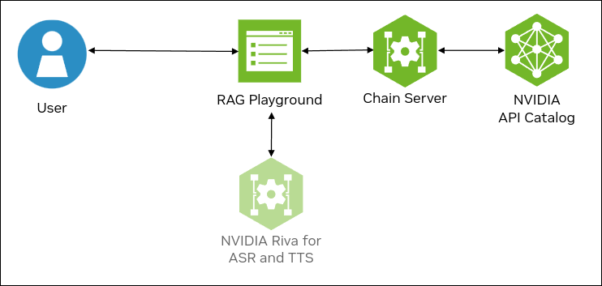
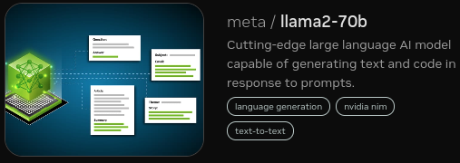
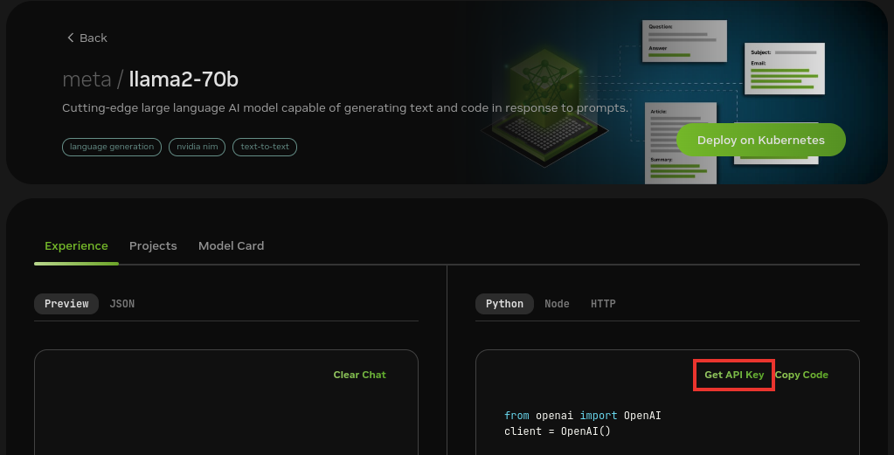

<!--
  SPDX-FileCopyrightText: Copyright (c) 2023 NVIDIA CORPORATION & AFFILIATES. All rights reserved.
  SPDX-License-Identifier: Apache-2.0

  Licensed under the Apache License, Version 2.0 (the "License");
  you may not use this file except in compliance with the License.
  You may obtain a copy of the License at

  http://www.apache.org/licenses/LICENSE-2.0

  Unless required by applicable law or agreed to in writing, software
  distributed under the License is distributed on an "AS IS" BASIS,
  WITHOUT WARRANTIES OR CONDITIONS OF ANY KIND, either express or implied.
  See the License for the specific language governing permissions and
  limitations under the License.
-->

# Query Decomposition

```{contents}
---
depth: 2
local: true
backlinks: none
---
```

## Example Features

This example deploys a recursive query decomposition example for chat Q&A.
The example uses the llama2-70b chat model from the NVIDIA AI Foundation endpoint for inference.

Query decomposition can perform RAG when the agent needs to access information from several different documents
(also referred to as _chunks_) or to perform some computation on the answers.
This example uses a custom LangChain agent that recursively breaks down the questions into subquestions.
The agent then attempts to answer the subquestions.

The agent has access to 2 tools:
- search: to perform standard RAG on a subquestion.
- math: to pose a math question to the LLM.

The agent continues to break down the question into subquestions until it has the answers that it needs to form the final answer.

```{list-table}
:header-rows: 1

* - Model
  - Embedding
  - Framework
  - Description
  - Multi-GPU
  - TRT-LLM
  - NVIDIA AI Foundation
  - Triton
  - Vector Database

* - llama2_70b
  - nvolveqa_40k
  - LangChain
  - QA chatbot
  - NO
  - NO
  - YES
  - NO
  - Milvus
```

The following figure shows the sample topology:

- The sample chat bot web application communicates with the chain server.
  The chain server sends inference requests to an NVIDIA AI Foundation Models endpoint.
- Optionally, you can deploy NVIDIA Riva. Riva can use automatic speech recognition to transcribe
  your questions and use text-to-speech to speak the answers aloud.



## Prerequisites

- Clone the Generative AI examples Git repository using Git LFS:

  ```console
  $ sudo apt -y install git-lfs
  $ git clone git@github.com:NVIDIA/GenerativeAIExamples.git
  $ cd GenerativeAIExamples/
  $ git lfs pull
  ```

- Install Docker Engine and Docker Compose.
  Refer to the instructions for [Ubuntu](https://docs.docker.com/engine/install/ubuntu/).

- Optional: Enable NVIDIA Riva automatic speech recognition (ASR) and text to speech (TTS).

  - To launch a Riva server locally, refer to the [Riva Quick Start Guide](https://docs.nvidia.com/deeplearning/riva/user-guide/docs/quick-start-guide.html).

    - In the provided `config.sh` script, set `service_enabled_asr=true` and `service_enabled_tts=true`, and select the desired ASR and TTS languages by adding the appropriate language codes to `asr_language_code` and `tts_language_code`.

    - After the server is running, assign its IP address (or hostname) and port (50051 by default) to `RIVA_API_URI` in `deploy/compose/compose.env`.

  - Alternatively, you can use a hosted Riva API endpoint. You might need to obtain an API key and/or Function ID for access.

    In `deploy/compose/compose.env`, make the following assignments as necessary:

    ```bash
    export RIVA_API_URI="<riva-api-address/hostname>:<port>"
    export RIVA_API_KEY="<riva-api-key>"
    export RIVA_FUNCTION_ID="<riva-function-id>"
    ```

## Get an API Key for the Llama 2 70B API Endpoint

Perform the following steps if you do not already have an API key.
You can use different model API endpoints with the same API key.

1. Navigate to <https://catalog.ngc.nvidia.com/ai-foundation-models>.

1. Find the **Llama 2 70B** card and click **Learn More**.

   

1. Click the **API** button and then click **Generate Key**.

   

1. Save the generated API key.

## Build and Start the Containers

1. In the Generative AI examples repository, edit the `deploy/compose/compose.env` file.

   Add the API key for the model endpoint:

   ```shell
   ...
   # Fill this out if you dont have a GPU. Leave this empty if you have a local GPU
   export NVIDIA_API_KEY="nvapi=..."
   ...
   ```

1. From the root of the repository, build the containers:

   ```console
   $ docker compose --env-file deploy/compose/compose.env -f deploy/compose/rag-app-query-decomposition-agent.yaml build
   ```

1. Start the containers:

   ```console
   $ docker compose --env-file deploy/compose/compose.env -f deploy/compose/rag-app-query-decomposition-agent.yaml up -d
   ```

   *Example Output*

   ```output
    ✔ Network nvidia-rag         Created
    ✔ Container chain-server     Started
    ✔ Container rag-playground   Started
   ```

1. Start the Milvus vector database:

   ```console
   $ docker compose --env-file deploy/compose/compose.env -f deploy/compose/docker-compose-vectordb.yaml up -d milvus
   ```

   *Example Output*

   ```output
   ✔ Container milvus-minio       Started
   ✔ Container milvus-etcd        Started
   ✔ Container milvus-standalone  Started
   ```

1. Confirm the containers are running:

   ```console
   $ docker ps --format "table {{.ID}}\t{{.Names}}\t{{.Status}}"
   ```

   *Example Output*

   ```output
   CONTAINER ID   NAMES               STATUS
   0be0d21b2fee   rag-playground      Up 33 minutes
   524905ec3870   chain-server        Up 33 minutes
   14cb139a2e4a   milvus-standalone   Up 34 minutes
   7a807d96c113   milvus-minio        Up 34 minutes (healthy)
   937e4165e875   milvus-etcd         Up 34 minutes (healthy)
   ```

## Next Steps

- Access the web interface for the chat server.
  Refer to [](./using-sample-web-application.md) for information about using the web interface.

  Ensure that you upload documents and use the knowledge base to answer queries.
- [](./vector-database.md)
- Stop the containers by running `docker compose -f deploy/compose/rag-app-query-decomposition-agent.yaml down` and
  `docker compose -f deploy/compose/docker-compose-vectordb.yaml down`.
