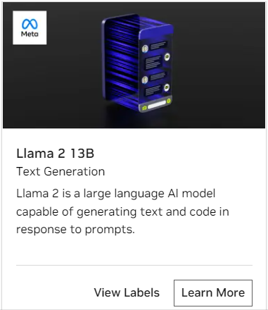

# NVIDIA AI Playground

**NVIDIA AI Playground** on NGC allows developers to experience state of the art LLMs accelerated on NVIDIA DGX Cloud with NVIDIA TensorRT nd Triton Inference Server. Developers get **free credits for 10K requests** to any of the available models. Sign up process is easy.

**Setup**

Please follow the instruction below to get access to AI playground API key

* Navigate to https://catalog.ngc.nvidia.com/ai-foundation-models
* Select any of the available models and click on learn more



* Select the ```API``` navigation bar and click on the ```Generate key``` option as shown below.


* Copy the generated key over to a safe place.


### Using Nvdia Cloud based LLM's

#### Step 1: Sign up to AI playground

- Follow the [above](#nvidia-ai-playground) instructions to get access to an API key.

#### Step 2: Set Environment Variables

- Modify ``compose.env`` in the ``deploy/compose`` directory to set your environment variables. The following variable is required.

    export AI_PLAYGROUND_API_KEY="nvapi-*"


#### Step 3: Build and Start Containers
- Pull lfs files. This will pull large files from repository.
    ```
        git lfs pull
    ```
- Run the following command to build containers.
    ```
        source deploy/compose/compose.env;  docker compose -f deploy/compose/docker-compose-playground.yaml build
    ```

- Run the following command to start containers.
    ```
        source deploy/compose/compose.env; docker compose -f deploy/compose/docker-compose-playground.yaml up -d
    ```
    > ⚠️ **NOTE**: It will take a few minutes for the containers to come up. Adding the `-d` flag will have the services run in the background. ⚠️

### Follow remaining steps from Quick start guide to interact with the pipeline using UI [here](../../RetrievalAugmentedGeneration/README.md#step-3-experiment-with-rag-in-jupyterlab)

- Example [notebook 6](../../notebooks/06_AI_playground.ipynb) showcases the usage of AI Playground LLM

### Using Nvdia Cloud based Embedding models

#### Step 1: Sign up to AI playground

- Follow the [above](#nvidia-ai-playground) instructions to get access to an API key.

#### Step 2: Set Environment Variables

- Modify ``compose.env`` in the ``deploy/compose`` directory to set your environment variables. The following variable is required.

    export AI_PLAYGROUND_API_KEY="nvapi-*"

#### Step 3: Update Config file
- Update the embedding model name and model engine in [config.yaml](../../deploy/compose/config.yaml)

    ```
        embeddings:
          model_name: nvolve
          model_engine: ai-playground
    ```

- Follow steps 3 and 4 from Quick start guide [here](../../RetrievalAugmentedGeneration/README.md#step-3-experiment-with-rag-in-jupyterlab) to build containers and start the pipeline.